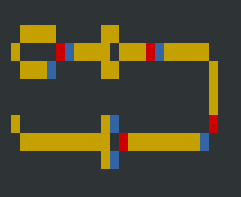

## Wireworld

**Important note: This program requires the Ncurses library in order to display the graphics.**

[Wireworld](https://en.wikipedia.org/wiki/Wireworld) is a [cellular automaton](https://en.wikipedia.org/wiki/Cellular_automaton)

### Compilation

In Linux, installing the Ncurses library can be done via: 

	sudo apt install libncurses - dev**
	
The program can be compiled via the following command:

	gcc wireworld.c neillncurses.c -Wall -Wfloat-equal -Wextra -O2 -pedantic -ansi -lncurses -lm
	
The program can then be run on any input text (.txt) file with the below command:

	./a.out wirewcircuit1.txt

Below is an example of what the program should output for the wirewcircuit1.txt (though the actual output should be animated).

